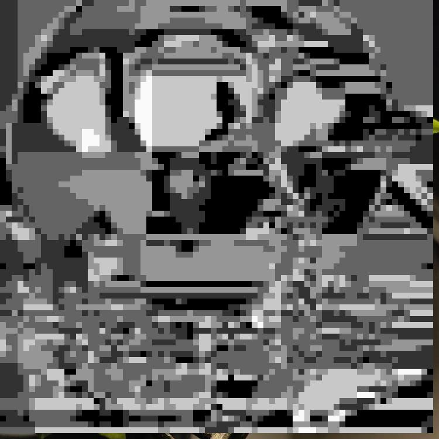

# Image to pixel filter
Фильтр, превращающий ваши изображения в черно-белые пиксельарты
##Сравнение результатов

*Входное изображение*

*Результат работы старой версии*

*Время работы старой версии фильтра*

*Результат работы новой версии*

*Время работы новой версии фильтра*

Таким образом старая версия, выполняла свою работу примерно за 6,1 cек,
тогда как новой версии требуется около 17,6 сек. Такое увеличение времени 
работы связано с тем что в новой версии появился ввод данных через консоль,
причем время ввода данных так же учитывается при подсчете времени работы.

Чтобы сделать сравнение честным запустим новый скрипт с уже заданными
входными данными.

*Время работы новой версии фильтра с уже введенными данными*

Версия фильтра с уже введенными данными справляется со своей задачей
всего за 0,18 сек, что в 34 раза меньше времени работы изначального скрипта.

##Описание выделенных функций
**get_average**: Возвращает среднюю яркость цвета в квадрате с длинной, равной 
размеру мозаики, с заданными координатами верхнего левого угла.

**make_gray**: Закрашивает все пиксели в том же квадрате в серый цвет, полученной
в функции *get_average* яркости и "округленной" до определенной градации серого.

**convert**: Основной метод. Переводит входное изображение в массив цветов. И делит
его на квадраты. После чего проходит по каждому квадрату, выполняя для него функцию
*make_gray*. Выводит полученный результат в виде изображения с заданным названием.

##Тестирование

*Результаты тестов*

##Отладка

*Результаты отладки*